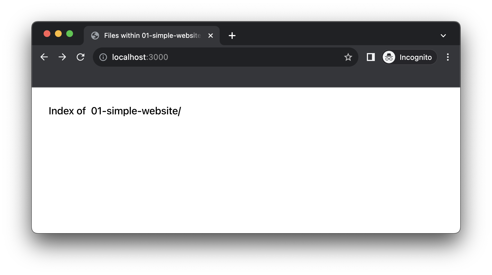
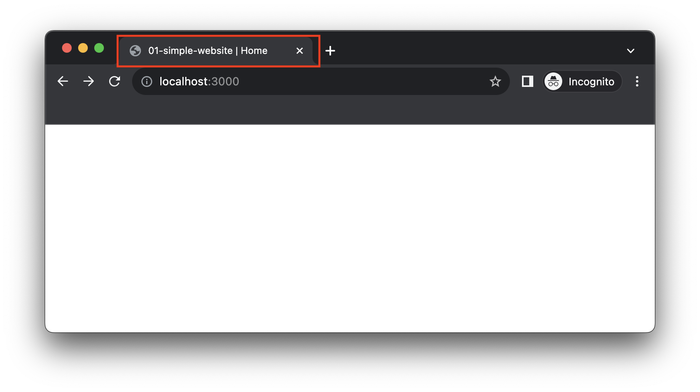
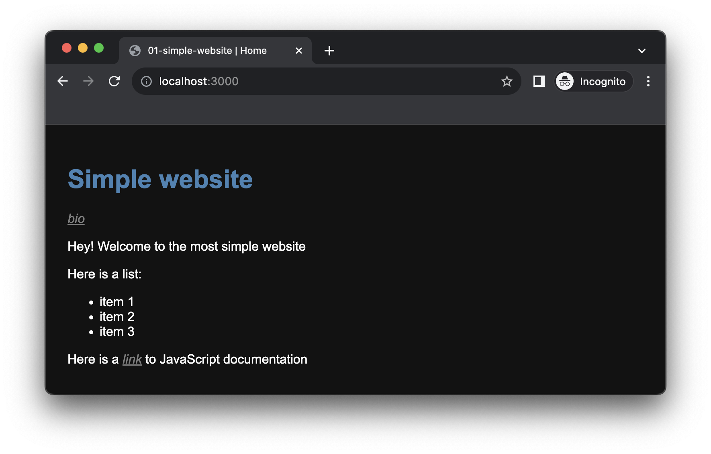
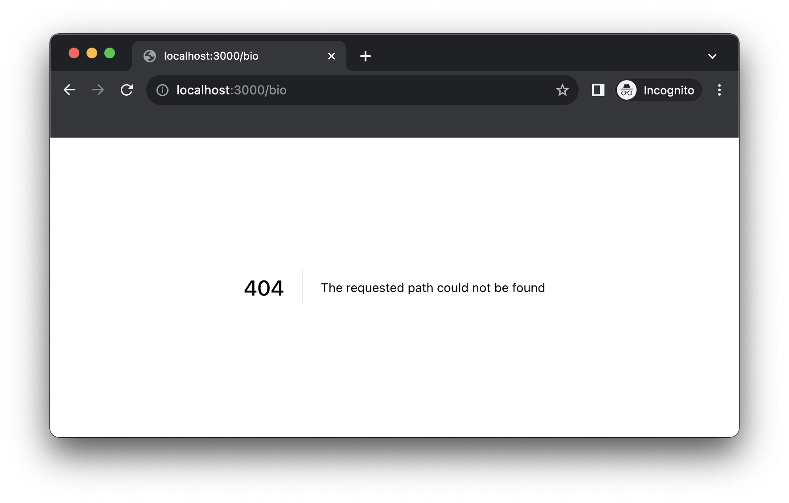
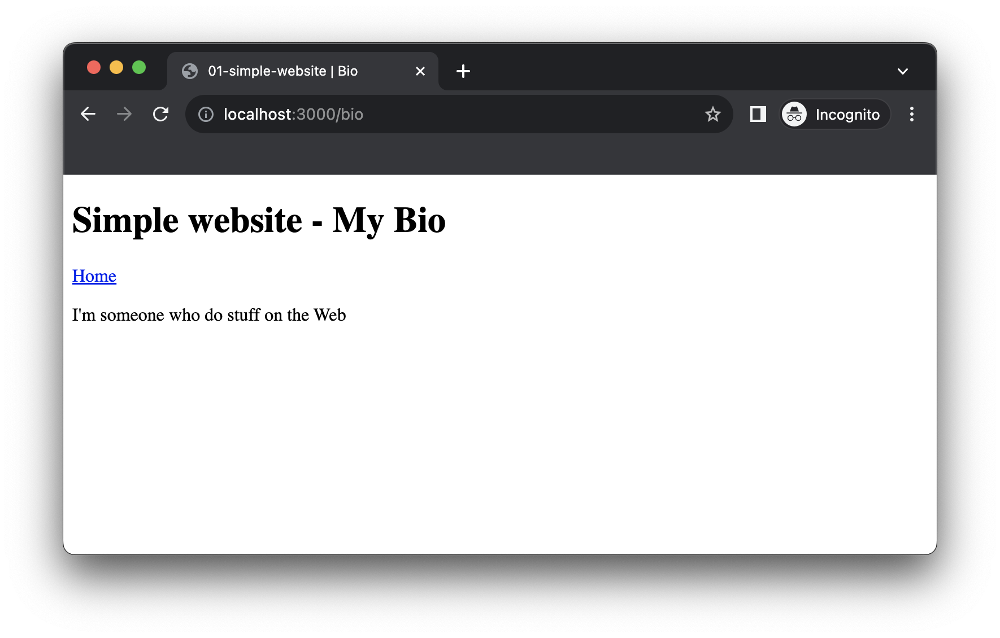
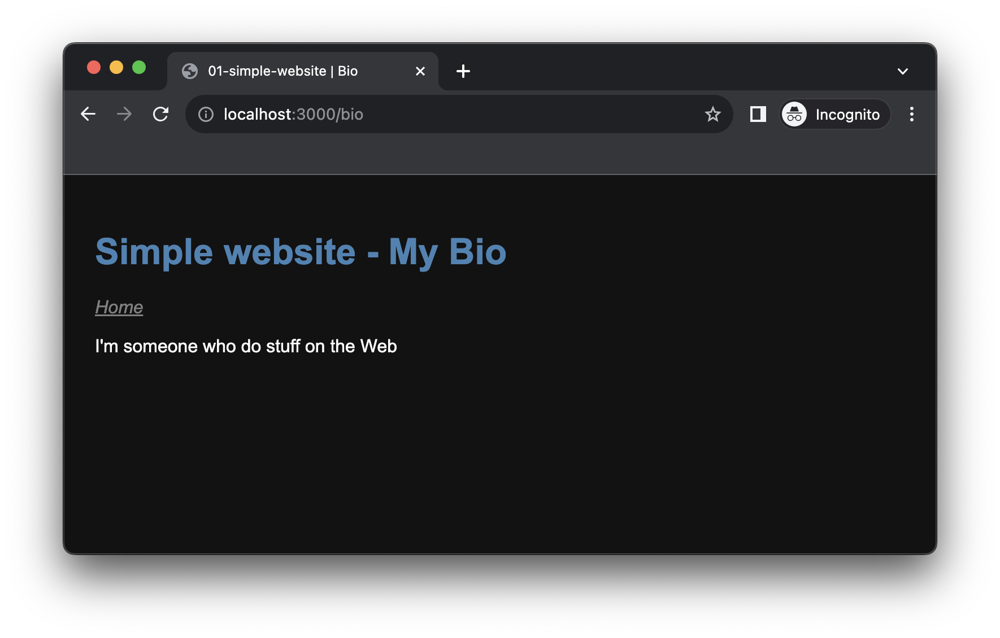
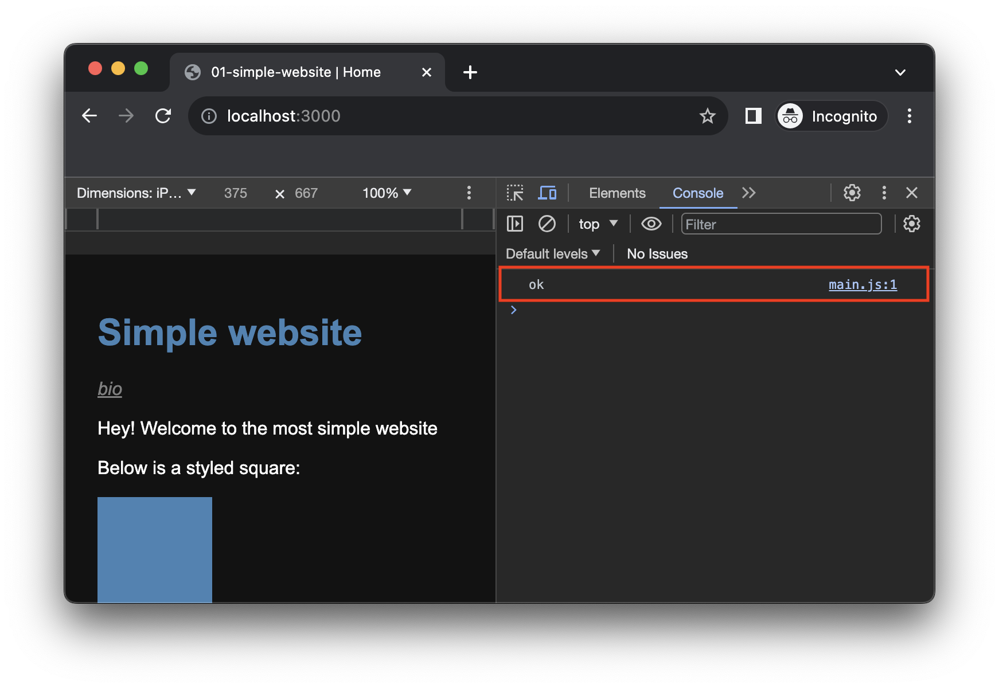
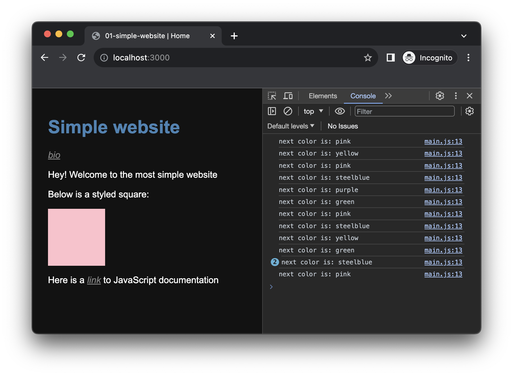

# Create a simple website

In this first hands-on tutorial, we will develop a simple website composed of two pages. This tutorial does not yet concern the Web Audio API, but aims at giving you some practical familiarity with the different concepts and tools we seen so far.

::: info
In these series, the example commands will be given as if all projects ara created in a `webaudio-tutorials` directory, itself located on your `Desktop`. If you want to put these files elsewhere feel free to do so, you will just need to adapt the paths in the commands accordingly.
:::

## Setting things up

First, let's create a new directory where we will put all our files. To do so, open a `Terminal` and create this new directory using the `mkdir` (for "make directory") command:

```sh
mkdir -p ~/Desktop/webaudio-tutorials/01-simple-website
```

You should now see a new directory called `webaudio-tutorials` on your `Desktop`:


Back to the `Terminal`, go to the directory using the `cd` (for "change directory") command:

```sh
cd ~/Desktop/webaudio-tutorials/01-simple-website
```

::: tip
You can think of `cd` as a way to navigate into your computer filesystem, just as you would do clicking around in the `Finder` but within the `Terminal`
:::

Now that we are located in our project directory, let's launch our Web server inside it using the following command:

```sh
serve
```

If everything went well, your terminal should look like the following, with the Web server launched in the directory you just created:


::: warning
It is **_very_** important to understand and to keep in mind that exposing a directory to the network means that **_all the files_** located in this directory will be accessible by **_any_** computer connected to the same network as your machine.  

**_So, BE CAREFULL TO NOT EXPOSE any sensitive or private information in this directory_**.  
:::

At startup, the web server logged some informations that will help you to access it from a Web browser. In particular we are interested by the "Local" address and port: [`http://localhost:3000`](http://localhost:3000).

If you open a Web browser and write this URL into the address bar, you should see something as the following:


Which is a default page provided by the server showing us that it has nothing to serve, as the directory is empty. 

Now that everything is up and running, let's start to write some little bits of code to create our actual website.

## Creating the home page

Open the directory inside the text editor you installed in the previous tutorial. 

::: info
In VSCode, "File > Open Folder", then navigate to locate the `01-simple-website directory` and click "open". VSCode will then ask you if you trust the authors of code, which is you, so click "Yes".

In Sublime "File > Open", then navigate to locate the `01-simple-website directory` and click "open".
:::

Once done let's create a new file called `index.html`:


 

::: tip
The `index.html` name name is important as this is the file that all Web servers will serve by default (i.e. when no specific file is requested). Make sure to always have an `index.html` in your directory.
:::

Once done, let's write the basic structure of an `HTML` document in our `index.html`:

```html
<!DOCTYPE html>
<html>
<head>
    <!-- meta informations about your page will go here -->
</head>
<body>
    <!-- the actual content of your page will go there -->
</body>
</html>
```

You can already notice that all HTML tags come with an opening and a closing tag, for example:
- `<body>` is the opening tag
- `</body>` is the closing tag

Also tags can be declared inside a another tags, here the `<head>` and `<body>` tags are inside the `<html>` tag. The HTML structure is always hierarchical, a tag opened inside another tag should aloways be closed within it, e.g.:

```html
// This is valid
<div><p>my text</p></div>
// This is invalid
<div><p>my text</div></p>
```

Once done, let's first add one line of code in the `<head>` section, to define the title of the document:

```html {4}
<!DOCTYPE html>
<html>
<head>
    <title>01-simple-website | Home</title>
</head>
<body>
    <!-- content of your page will go there -->
</body>
</html>
```

::: tip
You can see that the content inside `head` has been indented (using the "Tab" key). While this is not mandatory, it is a very good habit to take when coding. It makes the code more readable and will eventually help you find bugs more easily...
:::

If you reload the page in your Web browser (`Cmd + R`), you should now see title you wrote displayed as the tab title:

 

Let's continue with adding some content to our webpage:

```html {7-18}
<!DOCTYPE html>
<html>
<head>
  <title>01-simple-website | Home</title>
</head>
<body>
  <h1>Simple website</h1>
  <p>Hey! Welcome to the most simple website</p>
  <p>Here is a list:</p>
  <ul>
    <li>item 1</li>
    <li>item 2</li>
    <li>item 3</li>
  </ul>
  <p>
    Here is a <a href="https://developer.mozilla.org/">link</a>
    to JavaScript documentation
  </p>
</body>
</html>
```

In this snippet, we use a few different HTML tags that each describe a different type of content:
- `<h1>` defines a first level title.
- `<p>` defines a paragraph of text.
- `<ul>` defines an unordered list of `<li>` items.
- `<a>` defines a link to another Web page.

After reload (`Cmd + R`), your page should now look like the following:

 
## Adding some styles

Now that we have some basic content, let's change the appearence of our page using CSS. To that end, we define a `<style>` tag in the header of the document, in which you can write some CSS rules:

```html {6-20}
<!DOCTYPE html>
<html>
<head>
  <meta name="viewport" content="width=device-width, initial-scale=1">
  <title>01-simple-website | Home</title>
  <style>
    body {
      font-family: arial;
      padding: 20px;
      background-color: #121212;
      color: white;
    }
    h1 {
      color: steelblue;
    }
    a {
      color: grey;
      font-style: italic;
    }
  </style>
</head>
<body>
  <h1>Simple website</h1>
  <p>Hey! Welcome to the most simple website</p>
  <p>Here is a list:</p>
  <ul>
    <li>item 1</li>
    <li>item 2</li>
    <li>item 3</li>
  </ul>
  <p>
    Here is a <a href="https://developer.mozilla.org/">link</a>
    to JavaScript documentation
  </p>
</body>
</html>
```

In these CSS rules, we first define styles that will be applied to all the `body` tag (and _cascading_ to its content): change the background-color as well as text font and color. Then we define a more specialized style applied only to `h1` tags to change their text color. And finally, we define rules to change the appearence of the links, the `a` tags.

With these styles applied, yuor page should now look like the following screenshot:

 

## Adding a new page

Now that our homepage is ready let's see how you can add a second page to your website. 

First, add a link in the homepage to point to this new page which will contain for example your biography:

```html {3}
<body>
  <h1>Simple website</h1>
  <a href="./bio.html">bio</a>
  <p>Hey! Welcome to the most simple website</p>
  <p>Here is a list:</p>
  <ul>
    <li>item 1</li>
    <li>item 2</li>
    <li>item 3</li>
  </ul>
  <p>
    Here is a <a href="https://developer.mozilla.org/">link</a>
    to JavaScript documentation
  </p>
</body>
```

Refresh the page and you should see the link just below the title:

 
However, if you click on the link, the server will return a 404 error page. This is expected because there is no `bio.html` file that the server could retrieve:

 

To fix that, create a new file called `bio.html` in the project directory, and write the following content into it:

```html
<!DOCTYPE html>
<html>
<head>
  <title>01-simple-website | Bio</title>
</head>
<body>
  <h1>Simple website - My Bio</h1>
  <a href="./index.html">Home</a>
  <p>I'm someone who do stuff on the Web</p>
</body>
</html>
```

Refresh the page, and tada! 

 

We now have a small website composed of two pages, the "home" page and the "bio" page, and we can navigate between them through links.

## Sharing the styles

Adding this second page however introducted a new problem: the styles defined in the homepage are not defined in the `bio.html` file. Then the styling of the two pages differ... Which leaves us with two options:

1. Copy the `<style>` tag and the CSS rules defined in `index.html` into `bio.html`
2. Find a way to share the styles between the two HTML files

The first solution would of course work, but it would also create new issues in relatively short term. Indeed, if for some reason you want to add or change a style, e.g. change the titles color to red, you would have to report each change in each HMTL files (and a website is often composed of more than two pages), which is very combursome and error prone... 

A better solution is thus to put all the styles in a third file which will be imported by every HTML file, thus sharing the exact same styles between all pages of the website.

Let's thus create a new file called `style.css` in our directory and copy the content of the `<style>` tag defined in `index.html`:

```css
body {
  font-family: arial;
  padding: 20px;
  background-color: #121212;
  color: white;
}

h1 {
  color: steelblue;
}

a {
  color: grey;
  font-style: italic;
}
```

Then we need to update the `index.html` file to 1. remove the `<style>` tag and 2. to import the `style.css` through a `<link>` tag:

```html
<head>
  <title>01-simple-website | Home</title>
  <link rel="stylesheet" type="text/css" href="./style.css" />  // [!code ++]
  <style>                                                       // [!code --]
    body {                                                      // [!code --]
      font-family: arial;                                       // [!code --]
      padding: 20px;                                            // [!code --]
      background-color: #121212;                                // [!code --]
      color: white;                                             // [!code --]
    }                                                           // [!code --]
    h1 {                                                        // [!code --]
      color: steelblue;                                         // [!code --]
    }                                                           // [!code --]
    a {                                                         // [!code --]
      color: grey;                                              // [!code --]
      font-style: italic;                                       // [!code --]
    }                                                           // [!code --]
  </style>                                                      // [!code --]
</head>
```

::: info
Note that the `<link>` tag has no closing counterpart (i.e. `</link>`) and rather ends with `/>`. Such tags are called "self-closing" tags.
:::

Finally, let's add the exact same line of code in the `bio.html` file:

```html
<head>
  <title>01-simple-website | Bio</title>
  <link rel="stylesheet" type="text/css" href="./style.css" /> // [!code ++]
</head>
```

After reload, you should see the styles applied to both the pages:

 

## Adding some interaction

Let's now add a bit of interaction using _JavaScript_. To that end, let's modify our homepage to replace the list with a simple component with wich we will interact:

```html {7,8}
// index.html
<p>Here is a list:</p>  // [!code --]
<ul>                    // [!code --]
  <li>item 1</li>       // [!code --]
  <li>item 2</li>       // [!code --]
  <li>item 3</li>       // [!code --]
</ul>                   // [!code --]
<p>Below is a styled square:</p>  // [!code ++]
<div id="my-square"></div>        // [!code ++]
```

::: info
The `<div>` tag defines a generic container or zone on your page, it has no special semantic meaning but is often used to group related content together.
::: 

Let's also add some styles at the bottom of the `style.css` file to make it clearly visible in the page:

```css
#my-square {
  width: 100px;
  height: 100px;
  background-color: steelblue;
}
```

The "#" character at the beginning of the CSS rule allow to select a tag according to its `id` attribute as defined in the HTML, here the `<div id="my-square">`.

Your home page should now look like the following:

 
Everything is now ready to add some incredible interaction! Let's then create a new file called `main.js` in our website directory, and write the following line of code into it:

```js
console.log('ok');
```

Add the follwing line of code in the `<head>` section of your `index.html`, to import the _JavaScript_ file:

```html {4}
<head>
  <title>01-simple-website | Home</title>
  <link rel="stylesheet" type="text/css" href="./style.css" />
  <script defer src="./main.js"></script>
</head>
```

Once done, go back to your browser, open the JavaScript console (`Cmd + Alt + J` in 
_Chrome_ or `Cmd + Alt + I` in _Firefox_) and reload the page again. You should see the log from the _JavaScript_ appear in the console:

 

Now that everything is set up, let's write something a bit more interesting than just logging into the JavaScript console.

Go back to the javascript file and set up a few variables:

```js
// get a reference to div#my-square defined in the HTML
const mySquare = document.querySelector('#my-square');
// create a list of different colors
const colors = ['steelblue', 'pink', 'yellow', 'purple', 'green'];
```

Then, let's write some logic to change the color of the square when you click on it:

```js {6-16}
// get a reference to div#my-square define in the HTML
const mySquare = document.querySelector('#my-square');
// create a list of color
const colors = ['steelblue', 'pink', 'yellow', 'purple', 'green'];

// define a function that change the color of the square when executed
function changeColor() {
  // pick a random color from our list
  const randomIndex = Math.floor(Math.random() * colors.length);
  const nextColor = colors[randomIndex];

  console.log('next color is:', nextColor);
  // set the random color as the background color of our square
  mySquare.style.backgroundColor = nextColor;
}

// add the browser to execute the function each time a user
// clicks on the square
mySquare.addEventListener('click', changeColor);
```

Congrats! you now have an impressive interactive Web page!

 

This simple example also shows you how _JavaScript_ can modify HTML and CSS dynamically in response to users' action. 

## Shuting down the server

Now that the tutorial is finished, it is time to shutdown the Web server. To that end, go back to the `Terminal` window where the server is running and just press `Ctrl + C`:

 

That's it!

## Conclusion

In this tutorial you have created simple website using HTML, CSS and JavaScript. In this series, we won't go much further concerning HTML and CSS as we will mainly use JavaScript and higher level abstractions to create the user interfaces. If you are interested, there is plenty of good resources on the Web to learn these technologies further, e.g. on [MDN](https://developer.mozilla.org/en-US/docs/Web/Tutorials), but least you now have a basic idea of the different technologies involved and how they relates to each others.

Now that you an idea of the different technologies involved in the development of a Web page, let's dive into the subject of these series with an overview of the Web Audio API.


