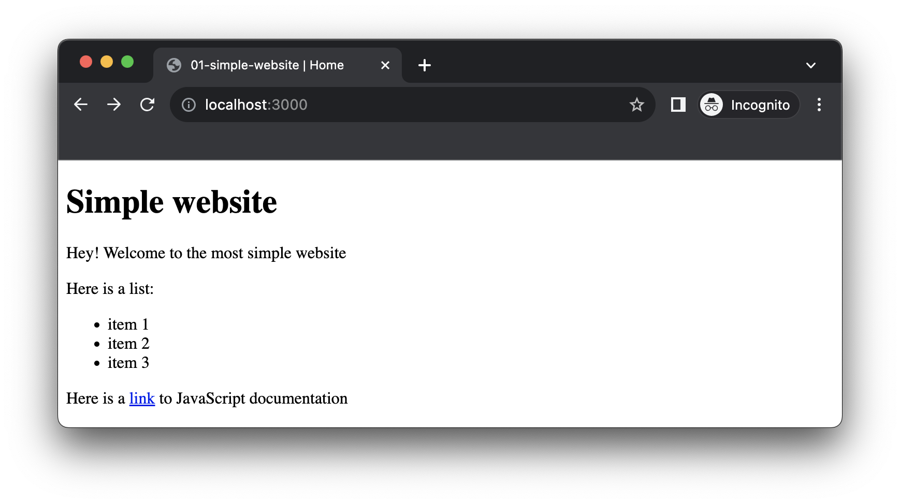
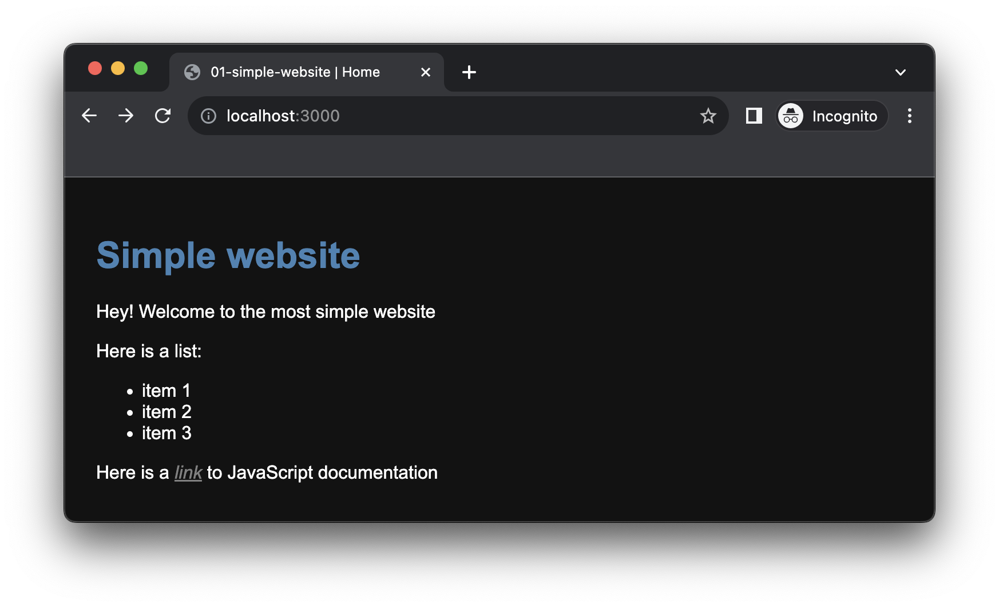
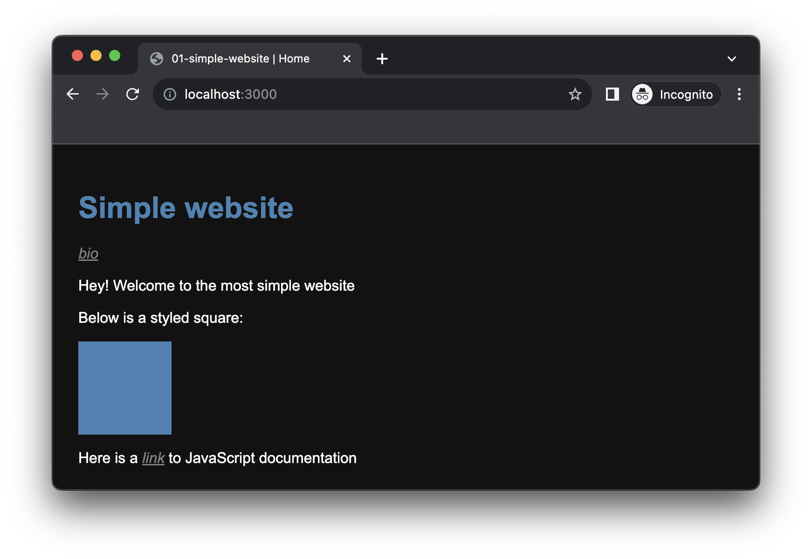

# Create a simple website

In this first hands-on tutorial, we will develop a simple website composed of two pages. While this tutorial will not concern the Web Audio API yet, it will help you to get a bit of practical familiarity with the different concepts we seen so far.

::: info
In these series, we will just put all tutorials inside a `webaudio-tutorials` directory, itself located on the "Desktop". If you want to put these files elsewhere feel free to do so, you will just have to adapt the path in the commands accordingly.
:::

## Setting things up

First let's create a new directory somewhere on your computer where we will put all our files. Open a `Terminal` and create a new directory using the `mkdir` (for "make directory") command:

```sh
mkdir -p ~/Desktop/webaudio-tutorials/01-simple-website
```

You should a new directory called `webaudio-tutorials` on your desktop at this point:


Back to the `Terminal`, go to the directory using the `cd` (for "change directory") command:

```sh
cd ~/Desktop/webaudio-tutorials/01-simple-website
```

::: tip
You can think of `cd` as a way to navigate into your computer directories, just as you would do clicking around in the `Finder`, but within the `Terminal`
:::

Let's now launch our Web server inside the directory, with the following command:

```sh
serve
```

If everything went well, your terminal look like the following, with the Web server launched in the directory you just created:


::: warning
It is **_very_** important to understand and to keep in mind that exposing a directory to the network means that **_all the files_** located in this directory will be accessible by **_any_** computer connected to the same network.  

**_So, DO NOT expose any sensitive or private information in this directory_**.  

This is an important thing to keep in mind whenever you deal with servers and networks, it's not specific to _soundworks_ applications.
:::

The web server, just logged a few bit informations that we need to access it from a Web browser, in particular the IP address and port at which it can be accessed: [`http://localhost:3000`](http://localhost:3000).

If open your Web browser of choice and write this URL into the address bar, you should see something as the following:


Which is default page provided by the server itself showing that it has nothing to serve as the directory is empty. So now that everything is ready, let's start to write some little bits of code to create our actual website.

## Creating the home page

Open the directory inside your the text editor you installed in the previous tutorial. 

::: info
In VSCode, "File > Open Folder", then navigate to locate the `01-simple-website directory` and click "open". VSCode will then ask you if you trust the authors of code, which is you, so click "Yes".
:::

Once done let's create a new file called `index.html`:


 

::: tip
The name `index.html` is the file that all Web servers will serve by default when no specific file is requested. Make sure to always have an `index.html` in your directory.
:::

Let's now write the Basic structure of an HTML document in our `index.html` file:

```html
<!DOCTYPE html>
<html>
<head>
    <!-- meta informations about your page will go here -->
</head>
<body>
    <!-- content of your page will go there -->
</body>
</html>
```

Once done, let's first had two 2 lines in the `<head>` tag:

```html {4-5}
<!DOCTYPE html>
<html>
<head>
    <meta charset="utf-8">
    <title>01-simple-website | Home</title>
</head>
<body>
    <!-- content of your page will go there -->
</body>
</html>
```

::: tip
You can see that the content inside `head` has been indented (using the "Tab" key). While this is not mandatory, this is a very good habit to take to make the code more readable and understandable. Eventually this will also help you find eventual bugs more easily...
:::

The first line just tells the Web browser with which encoding the file should be interpreted. The second line, as the tag name indicates, defines the title of your document.

If you reload the page on your Web browser (`Cmd + R`), you should now see the following, with the title displayed as the tab title:

 

Let's continue with adding some content to our webpage:

```html {8-19}
<!DOCTYPE html>
<html>
<head>
  <meta charset="utf-8">
  <title>01-simple-website | Home</title>
</head>
<body>
  <h1>Simple website</h1>
  <p>Hey! Welcome to the most simple website</p>
  <p>Here is a list:</p>
  <ul>
    <li>item 1</li>
    <li>item 2</li>
    <li>item 3</li>
  </ul>
  <p>
    Here is a <a href="https://developer.mozilla.org/">link</a>
    to JavaScript documentation
  </p>
</body>
</html>
```

In this snippet, we use a few HTML tags, each describing a different type of content:
- `<h1>` defines a first level title.
- `<p>` defines a paragraph of text.
- `<ul>` defines an unordered list of `<li>` items.
- `<a>` defines a link to another Web page.

After reload, your page should now look like the following:

 
## Adding some styles

Now that we have some basic content, let's change the appearence of our page using CSS. To that end let's a `<style>` tag in our header with the following CSS rules:

```html {7-21}
<!DOCTYPE html>
<html>
<head>
  <meta charset="utf-8">
  <meta name="viewport" content="width=device-width, initial-scale=1">
  <title>01-simple-website | Home</title>
  <style>
    body {
      font-family: arial;
      padding: 20px;
      background-color: #121212;
      color: white;
    }
    h1 {
      color: steelblue;
    }
    a {
      color: grey;
      font-style: italic;
    }
  </style>
</head>
<body>
  <h1>Simple website</h1>
  <p>Hey! Welcome to the most simple website</p>
  <p>Here is a list:</p>
  <ul>
    <li>item 1</li>
    <li>item 2</li>
    <li>item 3</li>
  </ul>
  <p>
    Here is a <a href="https://developer.mozilla.org/">link</a>
    to JavaScript documentation
  </p>
</body>
</html>
```

Here, we first define some styles that will be applied to the `body` tag, changing the background-color and text font and color. Then we define a more specialized style applied to `h1` tag to change the text color. And finally some rules to change the appearence of the `a` tags, i.e. the links.

When you reload the page, it should now look like the following screenshot:

 

## Adding a new page

Now that our homepage is ready let's see how you can add a second page to your brand new website. 

Let's first add a link in the homepage to point to this new page that will contain for example you biography:

```html
<body>
  <h1>Simple website</h1>
  <a href="./bio.html">bio</a> // [!code ++]
  <p>Hey! Welcome to the most simple website</p>
  <p>Here is a list:</p>
  <ul>
    <li>item 1</li>
    <li>item 2</li>
    <li>item 3</li>
  </ul>
  <p>
    Here is a <a href="https://developer.mozilla.org/">link</a>
    to JavaScript documentation
  </p>
</body>
```

Refresh the page and you should see the link just below the title:

 
However if you click on the link, the server will return a 404 error page, which is expected because there is no file called `bio.html` that the server could retrieve:

 

To fix that, let's create a file called `bio.html` in the project directory and put the following content into it:

```html
<!DOCTYPE html>
<html>
<head>
  <meta charset="utf-8">
  <title>01-simple-website | Bio</title>
</head>
<body>
  <h1>Simple website - My Bio</h1>
  <a href="./index.html">Home</a>
  <p>I'm someone who do stuff on the Web</p>
</body>
</html>
```

Refresh the page, and tada! 

 

We now have a small website composed of two pages, the home page and the bio page, and we can navigate between them through the dedicated links.

## Sharing the styles

Adding this second page however introducted a new problem: the styles defined in the homepage are not defined in the `bio.html` file, then the styling of the two pages differ... Which leaves us with two options:

1. Copy the `<style>` defined in `index.html` into `bio.html`
2. Find a way to share the styles in the two HTML files

The first solution would of course work, but it would also create new issues in the short term. Indeed if for some reason you want to change the style, e.g. change the title color to red, you would have to report the changes in both the pages (and even more if your site starts to grow), which would prone combursome and error prone... 

A better solution is thus to put all the styles in a third file, that all HTML file will import, allowing to share the same styles between all your website pages.

Let's thus create a new file called `style.css` in our directory and just copy the content of the `<style>` tag defined in `index.html`

```css
body {
  font-family: arial;
  padding: 20px;
  background-color: #121212;
  color: white;
}

h1 {
  color: steelblue;
}

a {
  color: grey;
  font-style: italic;
}
```

Then let's change our `index.html` file to remove the `<style>` and import the `style.css` through a special `<link>` tag:

```html
<head>
  <meta charset="utf-8">
  <meta name="viewport" content="width=device-width, initial-scale=1">
  <title>01-simple-website | Home</title>
  <link rel="stylesheet" type="text/css" href="./style.css" />  // [!code ++]
  <style>                                                       // [!code --]
    body {                                                      // [!code --]
      font-family: arial;                                       // [!code --]
      padding: 20px;                                            // [!code --]
      background-color: #121212;                                // [!code --]
      color: white;                                             // [!code --]
    }                                                           // [!code --]
    h1 {                                                        // [!code --]
      color: steelblue;                                         // [!code --]
    }                                                           // [!code --]
    a {                                                         // [!code --]
      color: grey;                                              // [!code --]
      font-style: italic;                                       // [!code --]
    }                                                           // [!code --]
  </style>                                                      // [!code --]
</head>
```

Finally, let's add the same line of code in our `bio.html` file:

```html
<head>
  <meta charset="utf-8">
  <title>01-simple-website | Bio</title>
  <link rel="stylesheet" type="text/css" href="./style.css" /> // [!code ++]
</head>
```

Reload to how your styles are now applied to both of your pages:

 

## Adding some interaction

Let's now add a bit of interaction using JavaScript. First let's modify our homepage to replace the list a component with wich we can interact:

```html {7,8}
// index.html
<p>Here is a list:</p>  // [!code --]
<ul>                    // [!code --]
  <li>item 1</li>       // [!code --]
  <li>item 2</li>       // [!code --]
  <li>item 3</li>       // [!code --]
</ul>                   // [!code --]
<p>Below is a styled square:</p>  // [!code ++]
<div id="my-square"></div>        // [!code ++]
```

::: info
The `<div>` tag only defines a zone on your page, it has no special semantic meaning but is often use to group related content together.
::: 

Let's also add some styles at the bottom of the `style.css` fiel to make it clearly visible in the page:

```css
#my-square {
  width: 100px;
  height: 100px;
  background-color: steelblue;
}
```

::: info
The "#" character at the beginning of the CSS definition allows to select a tag according to its `id` attribute defined in the HTML, i.e. `<div id="my-square">`.
The rules defined this way will only be applied to this specific HTML tag.
:::

Your home page should now look like this:

 
Everything is now ready to add some interaction! So let's create a new file called `main.js` in your website directory, and write the following line of code inside it:

```js
console.log('ok');
```

Then change the header of your `index.html` file to import the JavaScript file in a similar way as we did it for the CSS file:

```html {5}
<head>
  <meta charset="utf-8">
  <title>01-simple-website | Home</title>
  <link rel="stylesheet" type="text/css" href="./style.css" />
  <script defer src="./main.js"></script>
</head>
```

Now go back to your browser, open the JavaScript console (`Cmd + Alt + J` in 
_Chrome_ or `Cmd + Alt + I` in _Firefox_) and reload the page again, you should see the log from the JavaScript code appear in the console:

 

Everything is setup to write our incredibly interactive stuff!

Go back to the javascript file and set up a few variables:

```js
// get a reference to div#my-square define in the HTML
const mySquare = document.querySelector('#my-square');
// create a list of color
const colors = ['steelblue', 'pink', 'yellow', 'purple', 'green'];
```

Now let's write some logic to change the color of the square when you click on it:

```js {6-16}
// get a reference to div#my-square define in the HTML
const mySquare = document.querySelector('#my-square');
// create a list of color
const colors = ['steelblue', 'pink', 'yellow', 'purple', 'green'];

// listen for a "click" from the user and execute a function when
// such event happens
mySquare.addEventListener('click', () => {
  // pick a random color from our list
  const randomIndex = Math.floor(Math.random() * colors.length);
  const nextColor = colors[randomIndex];

  console.log('next color is:', nextColor);
  // set the random color as the background color of our square
  mySquare.style.backgroundColor = nextColor;
});
```

You now a super impressive interactive Web page!

 

This very simple example shows you how the JavaScript acts has a glue between HTML and CSS, and can modify them dynamically according to users' action. 

## Conclusion

In this tutorial you have created simple website using some HTML, CSS, and JavaScript. In this series, we won't go much further concerning HTML and CSS as we will mainly use JavaScript and higher level tools to create the interfaces, but at least you have an idea of the different technologies and how they relates to each others.

Now that you get more idea of how a web page works and of the different technologies involved, let's dive into the subject of these series with an overview of the Web Audio API.


