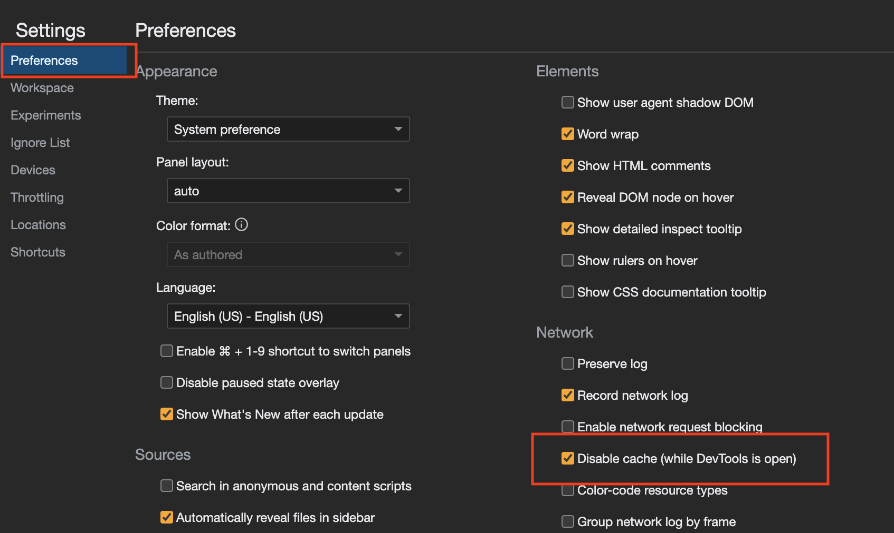
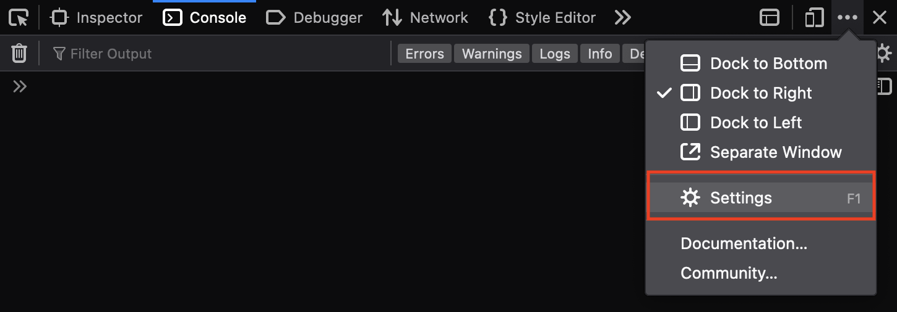
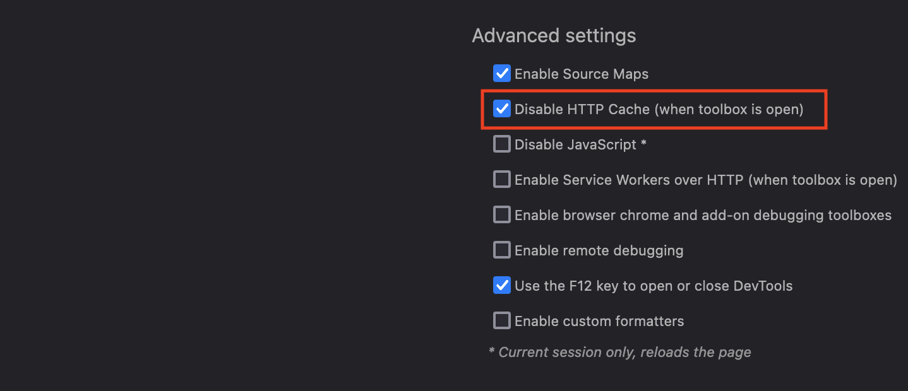

# Setting Up an Environment

In this tutorial, we will just install and configure a few things that will allow you to have all the necessary tools to develop simple Web pages in good conditions.

The set of tools we propose are not mandatory and many alternatives exists for each of them. If you already have a setup you like and are confortable with, just skip this page and proceed with your existing setup.

## Text Editor

First, the most important tool to write is to have a proper text editor. There are numerous free editors, each of them with their specific strengths and drawbacks (just keep in mind that the _best_ tool is generally the one you know well):

Here are two of them that are quite popular:

- VSCode - [download](https://code.visualstudio.com/) - _probably the most popular one in web dev nowadays_
- Sublime Text 3 - [download](https://sublimetext.com/3)

## Node.js

Second let's install the [Node.js](https://nodejs.org/) environment. Node.js is a cross-platform JavaScript runtime environment that is mostly used to develop servers or command-line tools. We won't make a extensive use of Node.js in these tutorials, but mostly use it to install and run the simple Web server we will need for developping our Web pages.

1. Open [https://nodejs.org](https://nodejs.org) in your favorite browser (which shall not be Safari).
2. Download the LTS (Long Term Support) version (at time of writting it is version 20.9.0).
3. Open the archive and follow the instructions chosing all default options...

To make sure eveything is installed, open a `Terminal` prompt
-  `Applications/Utilities/Terminal.app` on Mac
-  @todo - windows

And type the following command to see the version of the installed Node.js:

```
node -v
```

Press "Enter" to execute the command and you should see:

```
v12.16.1
```

Then type the following command to see the version of the installed Node Package Manager (i.e. `npm`):

```
npm -v
```

Press "Enter" to execute the command and you should see:

```
v12.16.1
```


::: info
Note that, depending on when you follow this tutorial, the actual versions you see in the terminal might change. This should not cause any issue with the rest of these tutorials
:::

## Web Server

An important tool to develop Web pages is a Web server that you can launch locally on your computer. In these tutorials, we will only need the most simple Web server, i.e. one that serves a file when the Web browser requests it.

Multiple options written in multiple language are available to have such server, in this tutorials we will just use [serve](https://www.npmjs.com/package/serve), a web server developped in the [Node.js](https://nodejs.org/) environment.

Open a new Terminal, then type:

```sh
npm install -g serve
```

And press `Enter` to execute the command.

This command basically ask the `npm` command we installed in the previous step to install the `serve` package globally (cf. `-g`) on your computer. This package has been tested to work well in every environment you might have.

## Configure your Web browser

Lastly, we will just configure your browser of choice (which shall _not_ be Safari) to discard all caching when running in development.

### Google Chrome

1. Open the "Development tools" panel:  
"View > Developer > Developer Tools" or `Cmd + Shift + J`

2. Open the "Settings" panel by clicking on the wheel on the top right of the development panel:


3. In the "Preference" menu, check the "Disable cache (while DevTools is open)" option:



### Firefox

1. Open the "Development tools" panel:  
"Tools > Browser Tools > Web Developer Tools" or `Cmd + Option + I`

2. Open the "Settings" panel by clicking on the wheel on the top right of the development panel:



3. In the "Advanced Settings" section, check the "Disable HTTP cache (when toolbox is open)" option:




## Conclusion

Your system is now ready to use for development! Let's continue with developping a some simple Web page to have a first hands-on with HTML, CSS and JavaScript.
